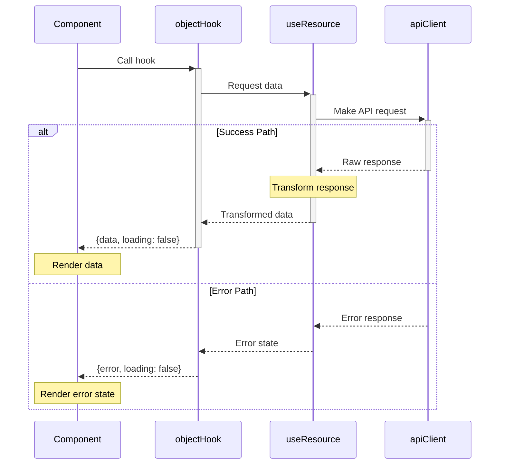
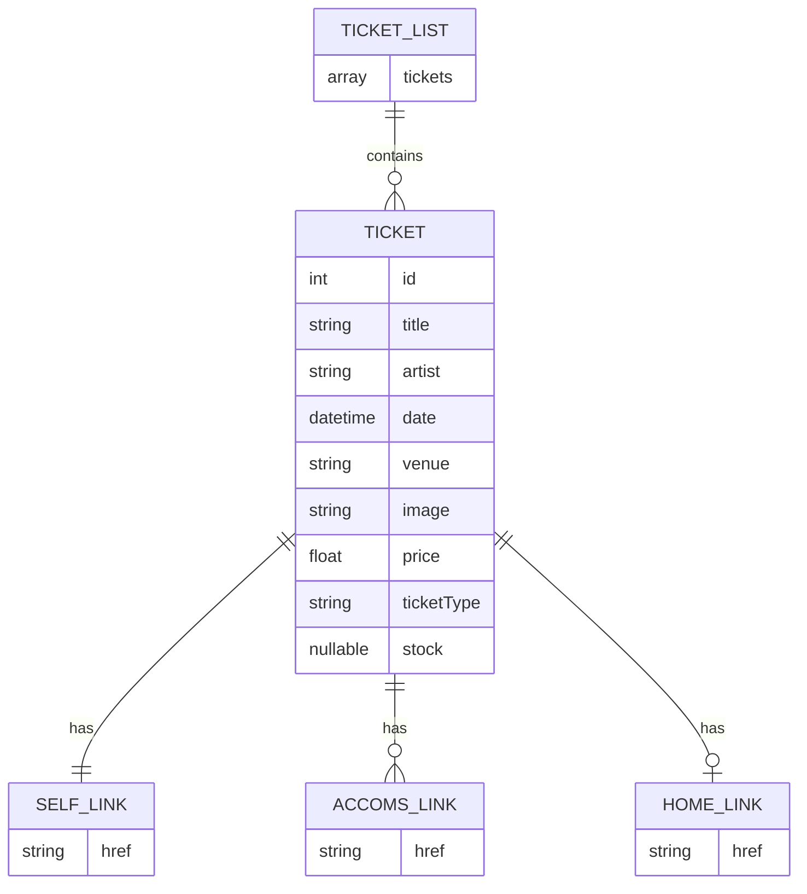
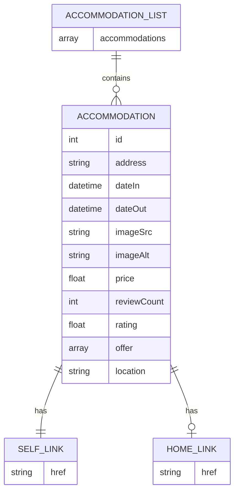

## User Authentication

For user authentication, we use `Auth0` platform that abstracts much of the complexity by handling token acquisition, storage, validation and renewal automatically. In particular, a JWT token is used as ID token serving as means of user identification. On top of that, we also have access token that represents the authorization granted to the user. 

The authentication flow in the web application starts when a user clicks `Log In` button that redirects them to Auth0's Universal login page. When the user entered correct credentials, `Auth0` validates them and after successfull authenticaion, it redirects back to the web application. This redirect includes the authorization code in the URL. The `Auth0` SDK automatically exchanges the authorization code for the access token which occurs via  background API call. The `Auth0` SDK then stores the tokens securely in browser memory. The SDK manages the tokens lifecycle, including expiration and renewal. 

## REST Communication

The implementation for the REST communication with the web application involves three main layers:

- API client layer that configures and manages the HTTP requests
- service layer that defines specific API endpoints for each object
- hook layer that provides hooks for components to consume API data

Specifically, the API client (`apiClient.js`) provides configured axios instance which ensures a consistent base URL, headers and timeout settings. Aside from that, for each object (package, accommodation, ticket) there is a service file definying the corresponding service files and a hook file with React hooks for components.

## ER diagrams of data resources

For tickets and accommodation data resources, we follow HATEOS pattern commonly used in REST APIs, where each resource includes links to related resource.

- `TICKET_LIST` corresponds to the `_embedded.ticketList` array we get from API call to `/tickets/`
- `TICKET` is an individual ticket in that array
- `LINK` represents the HATEOS links under the `_links` property

- `ACCOMMODATION_LIST` corresponds to the `_embedded.accommodationList` array we get from API call to `/accoms/`
- `ACCOMMODATION` is an individual ticket in that array
- `LINK` represents the HATEOS links under the `_links` property

In `useResource.js` we use `resourceKey` parameter to tell the hook which property inside the `_embedded` object contains your data. For tickets it would be `ticketsList` and for accommodations it would be `accommodationList`.